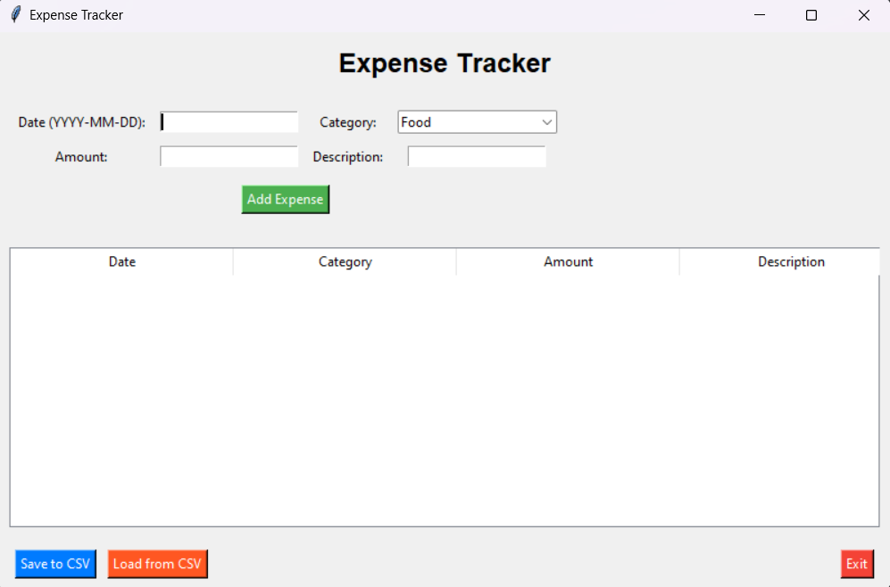
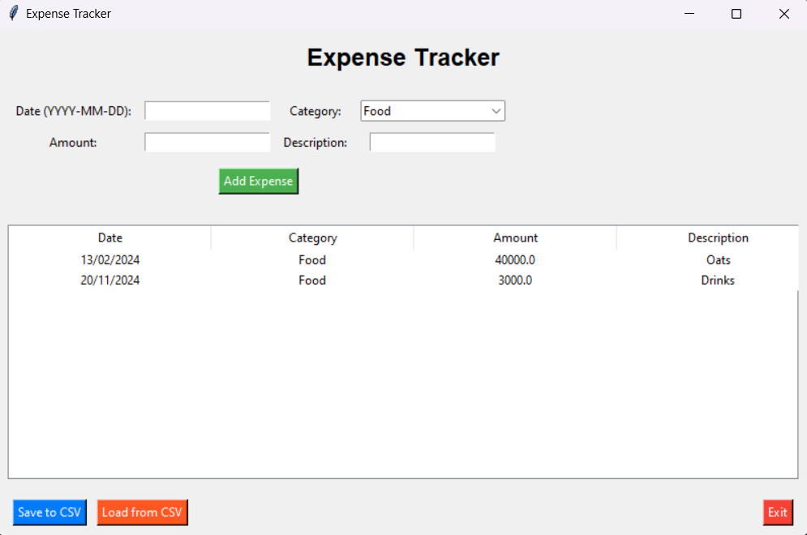

# 📒 Expense Tracker Application

The **Expense Tracker Application** is a Python-based tool designed to help users manage their personal or business expenses. With a simple and user-friendly interface, it allows users to add, view, save, and load expense data for better financial tracking.

---

## 📋 Features

### 🎯 Core Features
- **Add Expenses**:
  - Record expenses by entering the date, category, amount, and an optional description.
- **View Expenses**:
  - Display all expenses in a tabular format within the app.
- **Save Data**:
  - Save your expenses as a CSV file for future reference.
- **Load Data**:
  - Load expense data from an existing CSV file.

### 🔍 Validation and Feedback
- Ensures that required fields (date, category, and amount) are filled in.
- Validates that the amount field contains numeric input.
- Displays error or success messages to guide user actions.

### 🖥️ User Interface
- Dropdown menu for selecting categories.
- Scrollable table for managing large datasets.
- Dedicated buttons for key actions (Add Expense, Save to CSV, Load from CSV, Exit).

---

## Example ScreenShots

### Interface


### Desired Result


## 🛠️ Installation

### Prerequisites
- **Python 3.8 or later**: [Download Python](https://www.python.org/downloads/)

### Required Libraries
1. **pandas**: For handling tabular data.
2. **tkinter**: For building the GUI (pre-installed with Python).

Install pandas via pip:
```bash
pip install pandas
```

### Running the Application
1. Download or clone the repository:
   ```bash
   git clone https://github.com/Sid-cloud13/Expenses_traker.git
   cd expense-tracker
   ```
2. Run the application:
   ```bash
   python expense_tracker.py
   ```

---

## 🚀 Usage Instructions

1. **Add an Expense**:
   - Fill in the required fields:
     - **Date**: Enter in the format `YYYY-MM-DD`.
     - **Category**: Select from the dropdown (Food, Transport, etc.).
     - **Amount**: Enter a numeric value.
     - **Description**: (Optional) Add any additional details.
   - Click the **Add Expense** button to record the entry.

2. **Save Data**:
   - Click **Save to CSV** and choose a file name and location.
   - The data will be saved in a CSV format for easy access.

3. **Load Data**:
   - Click **Load from CSV** and select a previously saved file.
   - The table will populate with the data from the file.

4. **Exit**:
   - Click the **Exit** button to close the application.

---

## 📂 File Structure

```
expense_tracker.py   # Main application script
README.md            # Documentation file
```

---

## 💡 Example Usage Scenario

1. Start the application.
2. Add an expense for groceries on `2024-11-20` under the **Food** category, with an amount of `$50` and a description of "Weekly shopping."
3. Add additional expenses like transport, shopping, or utilities.
4. Save all expenses to a file named `expenses_november.csv`.
5. Reopen the application another day, load the saved file, and continue tracking.

---

## 🔒 Security Notes

- **Data Privacy**:
  - The application does not transmit or store data externally.
  - All data is saved locally in CSV format.

---

## 🚀 Future Enhancements

- Add functionality to:
  - Edit and delete entries directly in the table.
  - Filter expenses by date, category, or amount.
  - Generate graphical reports and summaries.
  - Introduce category customization (add/remove categories).

---

Happy expense tracking! 😊
